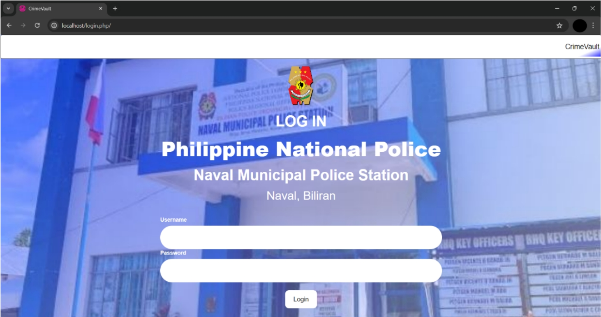
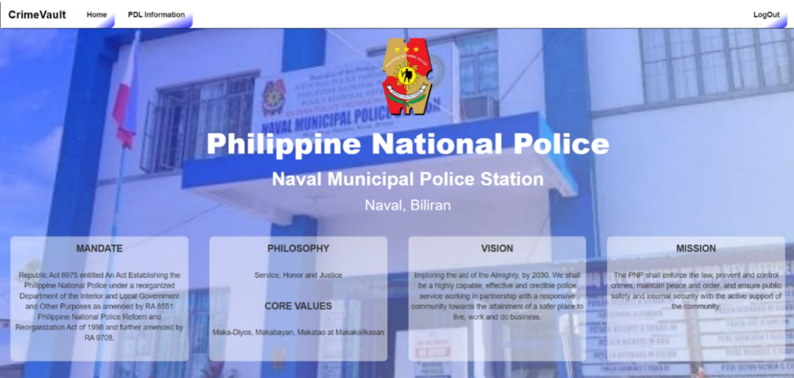
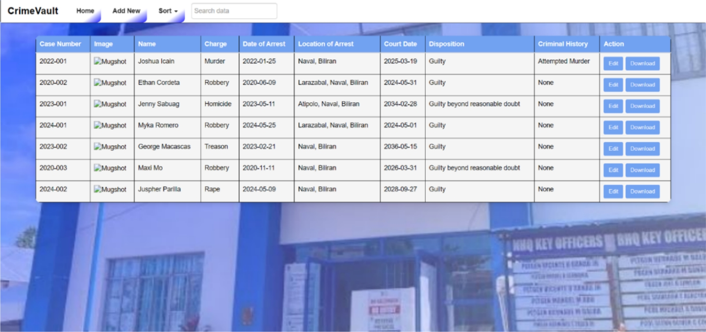
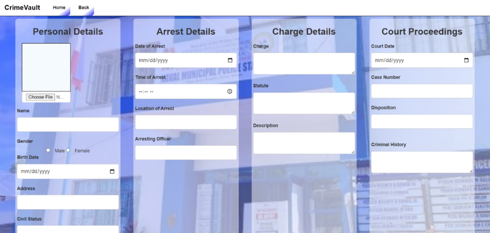
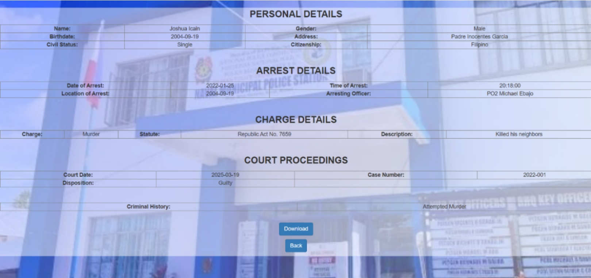
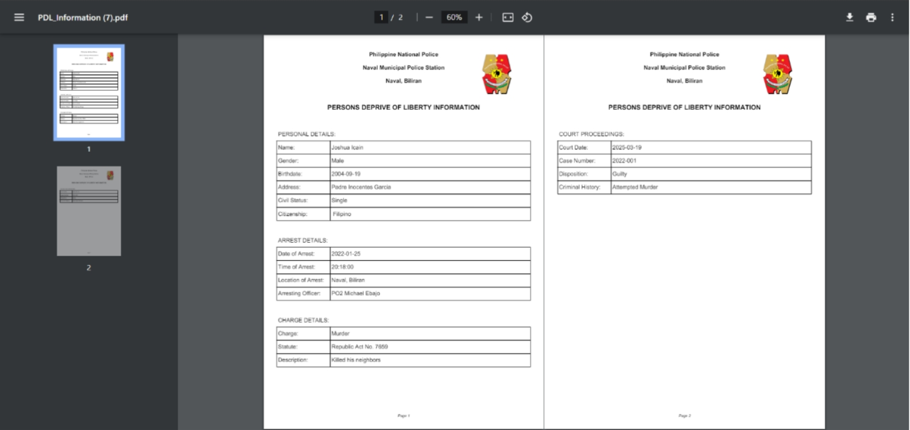

# Crime Vault: Advance Solution of a Persons Deprived of Liberty Record System

## Project Description
Crime Vault is an offline-capable web-based record management system designed to improve the efficiency, accuracy, and security of Persons Deprived of Liberty (PDL) records. It replaces traditional paper-based systems with a structured digital database to support law enforcement operations.
The system is developed using **HTML, CSS, JavaScript, PHP, and SQL**, ensuring fast data retrieval, secure storage, and improved record management for police personnel.

The system aims:
1. To maintain accurate records of Persons Deprived of Liberty (PDL).
2. To improve the search and retrieval efficiency of records.
3. To reduce manual and redundant record-keeping processes.

## Screenshots
### Log In Page

### Home Page

### PDL Information

### Add / Edit Record

### Download

### To Print

## Features
- **PDL Search:** Locate records using name or ID
- **PDL Details:** View complete inmate profiles
- **Add/Edit Records:** Manage and update PDL data securely
- **Download Records:** Export data to PDF for offline use

## System Development
### Front-End Development
The user interface is built using:
- HTML for structure
- CSS for design and layout
- JavaScript for interactivity (search, validation)

### Back-End Development
The system uses:
- PHP for server-side processing
- SQL for database management

## How to Run the Project
1. Install XAMPP or similar local server
2. Copy project folder to `htdocs`
3. Import `database.sql` into phpMyAdmin
4. Run Apache and MySQL
5. Open browser and go to: http://localhost/crime-vault/
